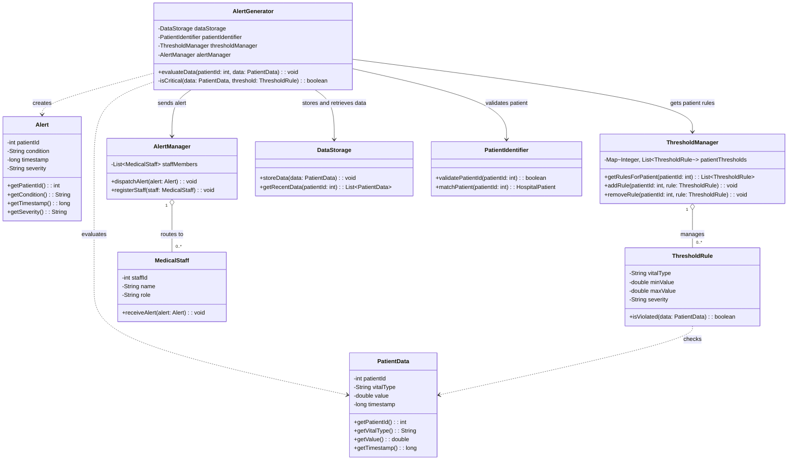
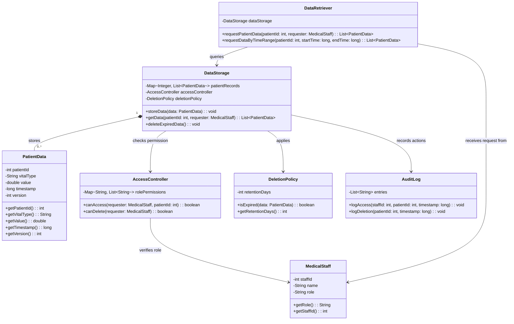
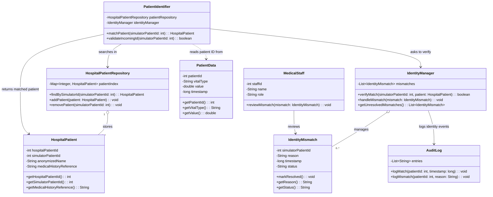
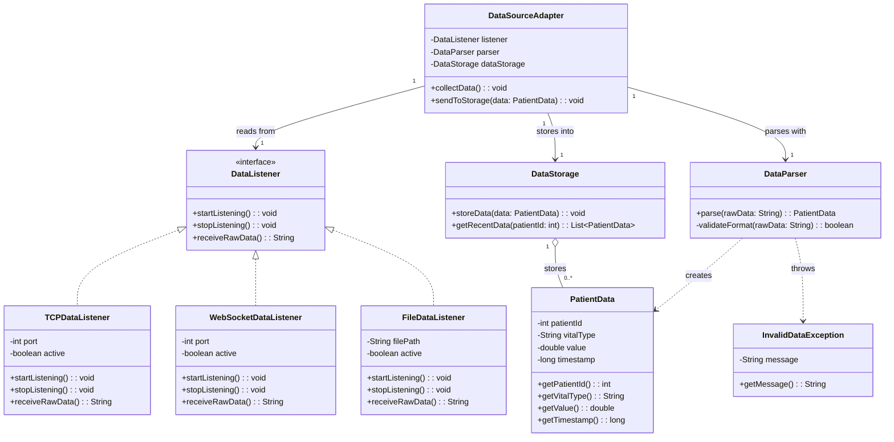

# UML Models for Cardiovascular Health Monitoring System

This folder contains UML class diagrams and explanations for four key subsystems of the Cardiovascular Health Monitoring
System (CHMS). The models focus on modularity, clear responsibilities, access control, and extensibility.

---

## 1. Alert Generation System

### Explanation

The Alert Generation System is responsible for evaluating incoming patient data in real time and deciding whether an
alert should be created. `AlertGenerator` is the central coordinator, but it does not do every task itself. It uses
`PatientIdentifier` to confirm that the incoming patient ID matches a known hospital patient, `DataStorage` to store or
retrieve recent patient data, `ThresholdManager` to obtain personalized threshold rules, and `AlertManager` to route
alerts to medical staff.

The design separates responsibilities clearly. `ThresholdRule` represents one medical rule, such as heart rate being
above a maximum value. This allows different patients to have different thresholds instead of using one global rule for
everyone. `Alert` is a simple data object that stores the patient ID, condition, timestamp, and severity. `AlertManager`
handles dispatching alerts, so the generator does not need to know which staff member receives which alert.

Most attributes are private to protect patient-related data and prevent uncontrolled access. Public methods expose only
the operations that other parts of the system need. The relationship between `ThresholdManager` and `ThresholdRule` is
aggregation because the manager keeps a collection of reusable rules. The relationship between `AlertManager` and
`MedicalStaff` is also aggregation because staff members exist independently from the alert manager. This structure
keeps the subsystem modular, easier to extend, and safer for a hospital monitoring context.

## 2. Data Storage System

### Explanation

The Data Storage System securely stores incoming patient measurements in an organized way. `DataStorage` groups records
by patient ID, making it easy to pull up everything you need. Each `PatientData` object captures one vital sign reading:
patient ID, measurement type, value, timestamp, and version number.
The timestamp lets you pull historical data whenever needed. The version number creates a trail of changes—if a record
gets updated or replaced, you can see what happened and when. In healthcare, that audit trail is essential.

The design separates storage from retrieval. `DataRetriever` handles requests from medical staff and asks `DataStorage`
for the needed records. This prevents external users from accessing the stored data directly. Before patient data is
returned, `AccessController` checks whether the requesting staff member has permission to view the data. This is
important because cardiovascular data is sensitive medical information and should only be available to authorized roles.

`DeletionPolicy` represents the rule for removing old records after a defined retention period. This keeps the system
from storing unnecessary data forever and supports privacy requirements. `AuditLog` records access and deletion actions,
making the system more traceable and accountable. The relationship between `DataStorage` and `PatientData` is
composition because records are stored as part of the storage structure. The rest of the relationships are associations
because the classes collaborate while keeping separate responsibilities.

## 3. Patient Identification System

### Explanation

The Patient Identification System links incoming simulator data to the correct hospital patient record.
`PatientIdentifier` is the main entry point. It receives the simulator patient ID from incoming `PatientData` and asks
`HospitalPatientRepository` to find the matching `HospitalPatient`. This keeps the matching logic separate from the rest
of the monitoring system, so alert generation and data storage do not need to know how hospital identities are resolved.

`HospitalPatient` contains the hospital-side patient information, including the hospital patient ID, simulator patient
ID, anonymized name, and a reference to medical history. Sensitive information is kept private, and the model uses an
anonymized name instead of exposing full personal details. `HospitalPatientRepository` stores and retrieves patient
records, while `IdentityManager` checks whether the match is valid and handles edge cases.

If no valid match is found, or if the incoming ID looks suspicious, an `IdentityMismatch` object is created. This
records the simulator ID, reason, timestamp, and status of the mismatch. `MedicalStaff` can review unresolved
mismatches, while `AuditLog` records matching and mismatch events for traceability. This is important in a hospital
system because incorrect patient identification can lead to unsafe alerts, wrong medical decisions, or privacy
violations. The design separates matching, storage, mismatch handling, and review responsibilities, which makes the
subsystem safer and easier to maintain.

## 4. Data Access Layer

### Explanation

The Data Access Layer connects the external signal generator to the internal CHMS system. The signal generator can send
data through different sources, such as TCP, WebSocket, or file logs, so the design uses a shared `DataListener`
interface. `TCPDataListener`, `WebSocketDataListener`, and `FileDataListener` all implement the same operations:
starting the connection, stopping it, and receiving raw data. This means the rest of the system does not need to know
where the data came from.

`DataSourceAdapter` coordinates the flow between the listener, parser, and storage. It receives raw input from a
selected `DataListener`, sends that raw input to `DataParser`, and then passes the resulting `PatientData` object to
`DataStorage`. This keeps networking, file reading, parsing, and storage separated into different responsibilities.

`DataParser` standardizes incoming data into a common `PatientData` format. If the input is malformed or missing
required fields, it can raise an `InvalidDataException`. This prevents broken or incomplete data from entering the
monitoring system. `PatientData` keeps only the structured information that the rest of the system needs: patient ID,
vital type, value, and timestamp.

This design is built to grow. If you need to pull data from a new source down the road—say, a REST API or a message
queue you can add a listener for it without touching the storage or alert systems. That clean separation means the
system stays maintainable and crucially, stays reliable in a real-time healthcare setting where mistakes are costly.